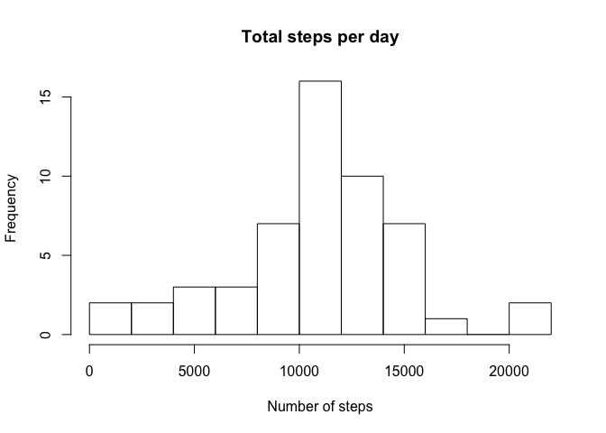
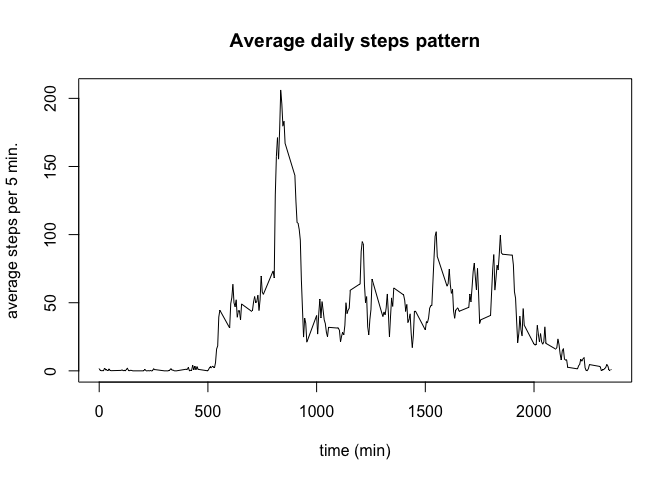
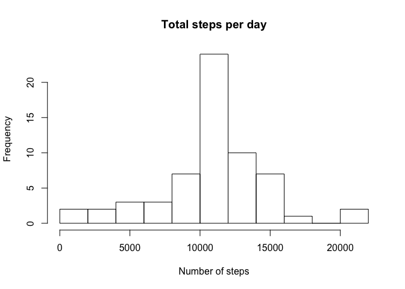
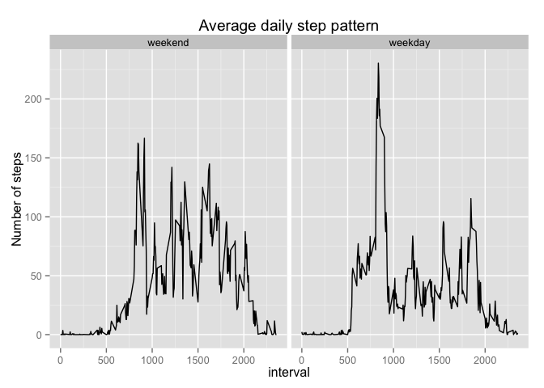

# Reproducible Research: Peer Assessment 1
This analysis deals with the step pattern of one test person. It makes use of data from a personal activity monitoring device. This device collects data at 5 minute intervals through out the day. The data consists of two months of data from an anonymous individual collected during the months of October and November, 2012 and include the number of steps taken in 5 minute intervals each day.

## Loading and preprocessing the data

The data is stored in a .csv file, which we load into R


```r
data = read.csv("activity.csv")
head(data)
```

```
##   steps       date interval
## 1    NA 2012-10-01        0
## 2    NA 2012-10-01        5
## 3    NA 2012-10-01       10
## 4    NA 2012-10-01       15
## 5    NA 2012-10-01       20
## 6    NA 2012-10-01       25
```

The data seems to already be in a nice and tidy format. The variables included in this dataset are:
- steps: Number of steps taking in a 5-minute interval (missing values are coded as NA)
- date: The date on which the measurement was taken in YYYY-MM-DD format
- interval: Identifier for the 5-minute interval in which measurement was taken

A quick automatic summary of the data:


```r
summary(data)
```

```
##      steps                date          interval     
##  Min.   :  0.00   2012-10-01:  288   Min.   :   0.0  
##  1st Qu.:  0.00   2012-10-02:  288   1st Qu.: 588.8  
##  Median :  0.00   2012-10-03:  288   Median :1177.5  
##  Mean   : 37.38   2012-10-04:  288   Mean   :1177.5  
##  3rd Qu.: 12.00   2012-10-05:  288   3rd Qu.:1766.2  
##  Max.   :806.00   2012-10-06:  288   Max.   :2355.0  
##  NA's   :2304     (Other)   :15840
```

## What is mean total number of steps taken per day?

First, let's look at the total number of steps taken each day. To this end, we sum the steps for each day and plot them in a histogram.


```r
totalSteps <- aggregate(data$steps~data$date, FUN=sum)

hist(totalSteps[,2], breaks=10, plot=TRUE, xlab="Number of steps", main="Total steps per day")
```

 

We can also look at the mean and median steps per day.

```r
options(scipen=999, digits=2)
meanSteps <- mean(totalSteps[,2])
medianSteps <- median(totalSteps[,2])
```

The mean number of steps per day is 10766.19 and the median value is 10765.

## What is the average daily activity pattern?

Let's look at the average daily acticity pattern. Take the average number of steps across all days for each interval and plot it.


```r
dailyAverage <- aggregate(data$steps~data$interval, FUN=mean)

plot(dailyAverage[,1], dailyAverage[,2], type="l", xlab="time (min)", 
     ylab="average steps per 5 min.", main="Average daily steps pattern")
```

 

We can also look at the interval that has the largest number of steps, on average.

```r
maxInterval <- dailyAverage[which.max(dailyAverage[,2]),1]
```
The most active interval is 835.

## Imputing missing values

So far, we have ignored the missing data. Some intervals (or even complete days) do not have any information on the number of steps. We decided to replace these values by the average value for that interval using the average set above.


```r
sum(is.na(data$steps))
```

```
## [1] 2304
```

```r
imputedData <- rep(data)
for(i in 1:length(data$steps))
  {
    if(is.na(data$steps[i]))
    {
        idx <- match(data$interval[i],dailyAverage[,1])
        imputedData$steps[i] <- dailyAverage[idx,2]
    }  
}
```

We now have a dataset where the missing values are imputed. It's not a bad idea to revisit the first histogram we made and see if our actions have affected the shape.


```r
totalSteps <- aggregate(imputedData$steps~imputedData$date, FUN=sum)

hist(totalSteps[,2], breaks=10, plot=TRUE, xlab="Number of steps", main="Total steps per day")
```

 

The histograms look pretty similar, but the frequency has increased because we have more data now. But what about the mean and median values?


```r
options(scipen=999, digits=2)
imputedMean <- mean(totalSteps[,2])
imputedMedian <- median(totalSteps[,2])
```

The mean number of steps per day is 10766.19 and the median value is 10766.19. The mean has not changed. This is not surprising since we imputed the missing data with the mean values, thereby keeping the mean intact. 
The median has changed. In fact, it is now equal to the mean! This is because we added quite some values that are equal to the mean during the imputation. 


## Are there differences in activity patterns between weekdays and weekends?

Perhaps the daily activity pattern differs in weekdays or weekends. To investigate this, we label the days in the imputed dataset to have a weekdays and weekend-days subset. 


```r
weekend <- c("Saturday","Sunday")
weekendDays <- weekdays(as.Date(imputedData$date)) %in% weekend
imputedData$dayTime <- factor(weekendDays, levels=c(TRUE, FALSE), labels=c('weekend', 'weekday')) 
```

We can now take the mean in each interval, and for each type of day (weekends, weekdays).

```r
averages <- aggregate(imputedData$steps, by=list(imputedData$interval,imputedData$dayTime), FUN=mean)
names(averages) <- c("intervals","dayType","steps")
```

Let's visualize this in a line plot:


```r
library(ggplot2)
g <- ggplot(averages, aes(x=intervals,y=steps)) #initial call: aestethics
g + geom_line() +
  facet_grid(. ~ dayType) +
  labs(title="Average daily step pattern") +
  labs(x="interval") +
  labs(y="Number of steps")
```

 

Indeed, the acticity pattern is quite different! The pattern is more regular in the weekend, while in the weekdays there is a strong peak between intervals 500 and 1000.

